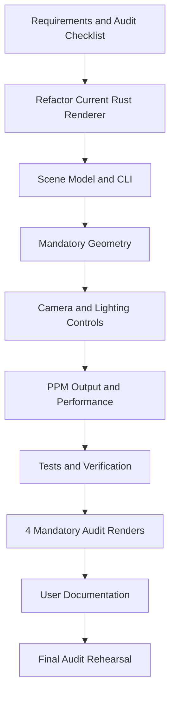
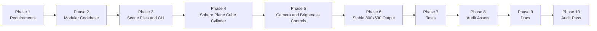

# RT Plan Visual

This visual roadmap maps the implementation path from the current baseline to an audit-ready Rust ray tracer.

## High-Level Flow



## What Each Phase Unlocks



## Deliverable Matrix

| Audit need | Implementation phase |
| --- | --- |
| Render a correct scene | Phase 2 to Phase 6 |
| Reduce resolution | Phase 3 and Phase 6 |
| Move camera | Phase 3 and Phase 5 |
| Sphere image | Phase 4 and Phase 8 |
| Plane + cube lower brightness image | Phase 4, Phase 5, and Phase 8 |
| One-of-each-objects image | Phase 4 and Phase 8 |
| Same scene from another perspective | Phase 5 and Phase 8 |
| Visible shadows | Phase 5 and Phase 7 |
| Clear documentation | Phase 9 |

## Current State vs Target State

```text
Current (all phases complete — audit-ready)
  |
  |-- PPM output valid for all scenes
  |-- Sphere, plane, cube, cylinder all work
  |-- Modular codebase (math, ray, camera, color, light, geometry, scene, renderer, config)
  |-- CLI: --scene, --width, --height flags
  |-- Movable camera and adjustable brightness via scene file
  |-- Shadows visible in all renders
  |-- Scene files: sphere.ron, plane_cube_low_brightness.ron, all_objects.ron,
  |   all_objects_alt_camera.ron, all_objects_dim.ron, demo.ron
  |-- deliverables/ with 4 required 800x600 ppm files
  |-- generate_deliverables.sh for reproducible renders
  |-- 800x600 renders complete in ~9s (release mode)
  |-- 22 unit tests passing
  |-- README documentation covers all audit requirements
  v
Audit-ready Rust ray tracer
```

## Recommended Work Rhythm

```text
Foundation
  Phase 1 -> Phase 2 -> Phase 3

Core features
  Phase 4 -> Phase 5 -> Phase 6

Hardening
  Phase 7

Delivery
  Phase 8 -> Phase 9 -> Phase 10
```
