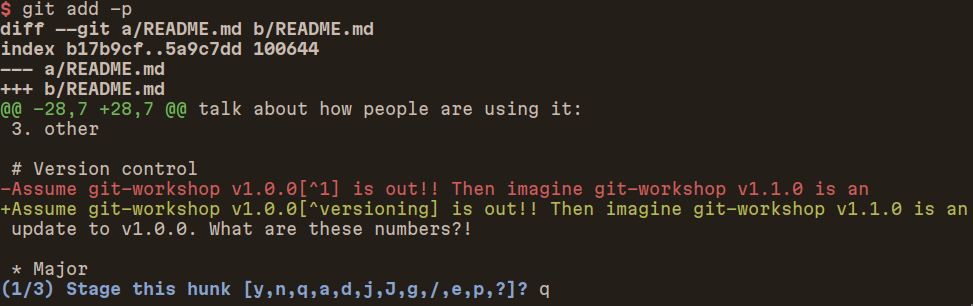

.. _git_add:

###########
``git add``
###########

***********
Add changes
***********

Typically
=========
You write something and you want to add your changes in the repository. To be
able to commit changes in the repository, one needs to "stage" those first.

Many go for this command: ``git add .``

This works… until it doesn’t.

Example
-------

In this very repository, I use some tools to build this presentation and
export it as a pdf file. However, I want only the source code to be in
the repository.

Using the command above will add the pdf files as well. I don’t want
that. YOU don’t want that!

Add files explicitly
====================

My changes are mostly in the README.md file (yes, this presentation is
written in markdown format, more about this in the end).

Let’s say that I edited that file, I would add it with command:

``git add README.md``

This is explicit!

Be more explicit
================

Well, I changed some stuff that I really want to add in the
presentation, but there are also some other stuffs that I am unsure that
I ’ve expressed in a good form.

Meet: ``git add -p [<FILE>]``

   git add -p

Note: if you want to partially add new files, you will need to let *git*
know your intention with ``git add -N <FILE>``.

