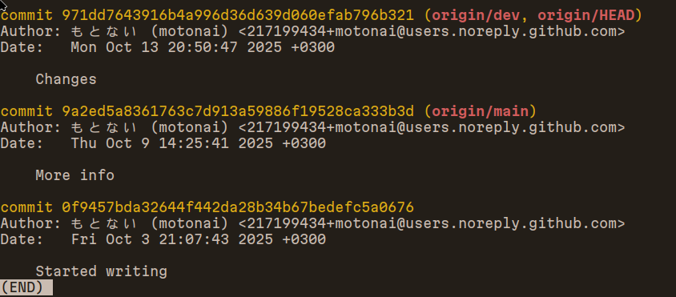
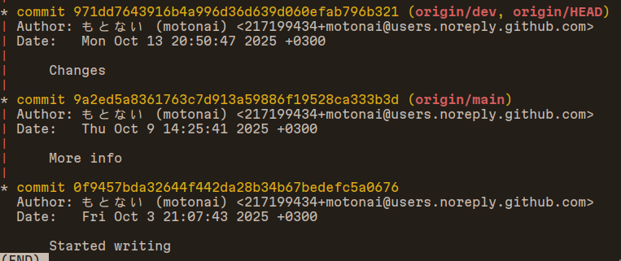

.. _git_log:

####
Logs
####

*****************************
Information about each commit
*****************************

-  hash,
-  who commited,
-  message,
-  date & time

************************
Let’s add graphics to it
************************

   ``git log --graph``

   git log –graph

Note the vertical red line: That’s a branch!!

You can also see there are some stuff in the parenthesis:

::

   origin/main
   ^ remote  ^ branch

We will figure these out later.

