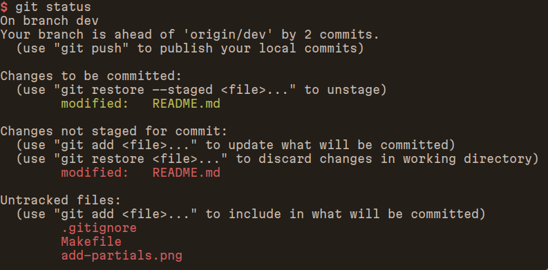

.. _states:

######
States
######

**********
git status
**********

*git* has some levels of state. These levels are:

-  :ref:`state_untracked`
-  :ref:`state_unstaged`
-  :ref:`state_staged`
-  :ref:`state_committed`

.. _state_untracked:

Untracked
---------

Files that haven’t been added in the repository.

What means untracked is that git can see the file, but it doesn’t track
changes into it, so, whenever we add it, it’s a new file.

.. _state_unstaged:

Unstaged
--------

Unstaged files are files that are added in the repository, have changes but
those changes aren’t added yet.

.. _state_staged:

Staged
------

When we use the *``git add``* command, we *stage* whatever we added.

.. _state_committed:

Commited
--------

Finally, if we committed those staged changes, well, they are committed
:P

So committed files won't show in ``git status`` but in ``git log``.
