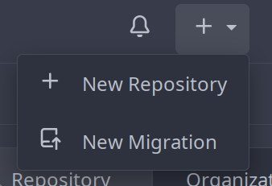

===================
Create a repository
===================

.. _create_local_repo:

-------
Locally
-------

::

  mkdir git-game
  cd git-game
  git init

.. _create_remote_repo:

--------------------------
Create a remote repository
--------------------------

   New repository

Name it "git-game".

