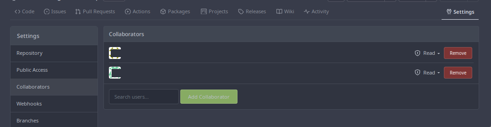

.. _git-remotes:

#######
Remotes
#######

**********
Definition
**********

A **remote** is a key-value pair list (name-url). You can add, remove
and modify them by name and you can list all of them.

When you clone a git repository, the source URL is saved in your remotes
with the name ‘*origin*’.

***********
Explanation
***********

``git remote -v``

will print all the available remote repositories!

Default remote
==============

A fresh new repository has no remotes.

However, when we clone a repository with “git clone”, the default remote (the
one we cloned from) is saved as the *origin* remote.

.. _git_remote_add:

Add a remote
------------

::

    $ git remote add origin URL

So, when we push from our local repo to the remote one we do:

- ``git push origin main``
- ``git push [remote] [branch]``

Some default settings allow us to omit “origin main”.

-  ``git fetch --all``, ``git pull/push`` and ``git remote``

Add your remote, locally
------------------------

::

    $ git remote add origin https://platform.zone01.gr/git/<username>/git-game

.. _add_collaborators_read:

Add collaborators
=================

Find a team of 2 or 3 people and add them as collaborators in gitea. Be sure
that you give them *Read* access.

The whole group should grant *Read* access to each other.

.. _add_remotes_locally:

Add their remotes, locally
--------------------------

::

    $ git remote add origin https://platform.zone01.gr/git/<username>/git-game

