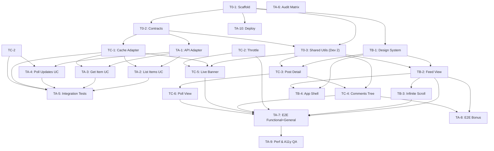

# Implementation Plan — clonernews

> A HackerNews UI client built with vanilla JavaScript, Vite, and Biome.
> Three developers work in parallel across independent tracks.

---

## 1. Project Summary

**Goal:** Build a polished, production-grade UI for the [HackerNews API](https://hacker-news.firebaseio.com/v0/) that handles stories, jobs, polls, comments (including nested sub-comments), lazy-loaded pagination, and live-data notifications every 5 seconds. Deployed as a static site on GitHub Pages.

**Tech stack:**

| Layer | Choice | Rationale |
|---|---|---|
| Build tool | Vite (vanilla template) | Near-instant HMR, native ESM, zero framework lock-in |
| Linter/Formatter | Biome | Unified Rust-based tool, replaces ESLint + Prettier |
| Language | Vanilla JS (ES2026) | Per AGENTS.md — `const`, arrow fns, `Temporal`, immutable arrays, `using`, Signals |
| Styling | Vanilla CSS (custom properties) | Maximum control, no utility-class framework |
| Testing | Vitest (unit) + Playwright (e2e) | Vite-native test runner, real-browser audit tests |
| CI/CD | GitHub Actions | Policy gate + automated deployment to GitHub Pages |
| Hosting | GitHub Pages | Static site from `dist/` output of `vite build` |

**Architecture:** Feature-first, Clean Architecture layers, Functional Core / Imperative Shell.

---

## 2. Directory Structure (Screaming Architecture)

```
clonernews/
├── .agents/                    # Agent skills
├── .github/
│   ├── pull_request_template.md
│   └── workflows/
│       ├── policy-gate.yml     # PR quality gate
│       └── deploy.yml          # GitHub Pages deployment
├── docs/                       # Requirements, audit, API docs, this plan
├── public/                     # Static assets (favicon, fonts, etc.)
├── src/
│   ├── main.js                 # App entry — bootstraps router, live-data poller
│   ├── app.css                 # Global design tokens & reset
│   │
│   ├── core/                   # Pure domain — ZERO I/O, ZERO DOM
│   │   ├── entities/
│   │   │   └── item.js         # Item entity (story, job, poll, pollopt, comment)
│   │   ├── interfaces/
│   │   │   ├── api-interface.js     # Abstract API interface (JSDoc typedef)
│   │   │   └── storage-interface.js # Abstract cache interface
│   │   └── use-cases/
│   │       ├── list-items.js   # Paginate & filter items by type
│   │       ├── get-item.js     # Fetch single item with comments tree
│   │       └── poll-updates.js # Diff changed-items for notifications
│   │
│   ├── infra/                  # Infrastructure adapters — I/O lives here
│   │   ├── hn-api-adapter.js   # fetch-based HN REST calls               [Dev 1]
│   │   ├── cache-adapter.js    # In-memory Map cache with TTL             [Dev 3]
│   │   └── throttle.js         # Generic throttle/debounce utilities      [Dev 3]
│   │
│   ├── features/
│   │   ├── feed/               # Main feed — tabs, list, pagination       [Dev 2]
│   │   │   ├── feed.view.js
│   │   │   ├── feed.controller.js
│   │   │   └── feed.css
│   │   ├── post-detail/        # Single item detail page                  [Dev 3]
│   │   │   ├── post-detail.view.js
│   │   │   ├── post-detail.controller.js
│   │   │   └── post-detail.css
│   │   ├── comments/           # Recursive nested comment tree            [Dev 3]
│   │   │   ├── comments-tree.view.js
│   │   │   └── comments.css
│   │   ├── live-banner/        # Live-data notification banner            [Dev 3]
│   │   │   ├── live-banner.view.js
│   │   │   ├── live-banner.controller.js
│   │   │   └── live-banner.css
│   │   └── polls/              # Poll rendering with pollopt bar chart    [Dev 3]
│   │       ├── poll.view.js
│   │       ├── poll.controller.js
│   │       └── poll.css
│   │
│   ├── shared/                 # Cross-feature UI primitives              [Dev 2]
│   │   ├── router.js           # Hash-based SPA router
│   │   ├── dom-helpers.js      # Safe DOM sink wrappers (createElement etc.)
│   │   ├── time-format.js      # Temporal-based "X minutes ago" formatter
│   │   └── signals.js          # Lightweight reactive signal primitives
│   │
│   └── styles/                 # Global design tokens & animations        [Dev 2]
│       ├── reset.css
│       ├── tokens.css
│       └── animations.css
│
├── tests/
│   ├── unit/                   # Dev 1 scope — Vitest
│   │   ├── infra/
│   │   ├── core/
│   │   └── shared/
│   └── e2e/                    # Dev 1 scope — Playwright
│       └── audit/
│           ├── audit-question-map.js
│           ├── stories.spec.js
│           ├── jobs.spec.js
│           ├── polls.spec.js
│           ├── comments.spec.js
│           ├── load-more.spec.js
│           └── live-data.spec.js
│
├── AGENTS.md
├── biome.json
├── index.html
├── package.json
└── vite.config.js
```

---

## 3. Workflow Tracks (3 Developers)

> **Principle:** Each track owns non-overlapping directories. Shared contracts (interfaces, entities, router, signals) are established first in a **shared kick-off ticket** before tracks diverge.

### Track A — Core, Use Cases, All Tests & Delivery
**Owner:** Dev 1
**Scope:** `src/core/` (entities, interfaces, use-cases), `src/infra/hn-api-adapter.js`, `tests/` (all unit, integration & e2e), `.github/workflows/`, project scaffold, `vite.config.js`.
**Character:** The engine room — domain entities, all three use-cases, the HN API adapter, every test across the codebase (unit, integration, e2e/QA), CI pipeline, and GitHub Pages deployment. Zero UI work.
**Estimated effort:** ~30–35h

### Track B — Shared Utilities, Design System, Feed & App Shell
**Owner:** Dev 2
**Scope:** `src/shared/`, `src/styles/`, `src/features/feed/`, `index.html`, `public/`, `src/app.css`, `src/main.js`.
**Ownership note:** Track B may edit `tests/unit/features/feed/` for feed-specific behavior and `data-testid` contract updates, with Track A review required before merge.
**Character:** The UI foundation — reactive signals, safe DOM helpers, router, time formatter, design tokens, the feed list with tab navigation and infinite scroll, and the overall responsive app shell wiring.
**Estimated effort:** ~28–32h

### Track C — Infra Utilities & Feature Views
**Owner:** Dev 3
**Scope:** `src/infra/cache-adapter.js`, `src/infra/throttle.js`, `src/features/post-detail/`, `src/features/comments/`, `src/features/live-banner/`, `src/features/polls/`.
**Character:** Two small but critical infra utilities (cache, throttle) that Dev 3's own features depend on directly, plus all four interactive feature surfaces — post detail, nested comments, live notification banner, poll rendering.
**Estimated effort:** ~24–28h

---

## 4. Tickets (Tracked in `docs/tickets.md`)

### Phase 0 — Shared Kick-off (all devs, 1 session)

#### T0-1: Project Scaffold
Status: this workspace now contains the initial scaffold, shared contracts, shared utilities, and starter documentation for Phase 0.
**Assignee:** Dev 1 (Track A)
**Description:** Initialize Vite vanilla template, install Biome and essential dev dependencies, configure `biome.json`, add npm scripts, create directory structure skeleton. Configure `vite.config.js` with the correct `base` path.
**Details:**
- Install `vite`, `vitest`, `@playwright/test`, `dompurify`, and `@js-temporal/polyfill`.
- Add npm scripts: `dev`, `build`, `preview`, `check` (Biome), `test` (Vitest).
- `vite.config.js` sets `base: '/clonernews/'` (match repo name exactly).
- Scaffold all empty feature dirs with `.gitkeep` so Tracks B and C can start immediately.
**Acceptance:**
- `npm run dev` → renders the scaffold boot screen at `localhost:5173`
- `npm run build` → produces `dist/`
- `npm run check` → Biome passes
- `npm run test` → Vitest exits 0

#### T0-2: Core Contracts & Entities
**Assignee:** Dev 1 (Track A)
**Description:** Define `src/core/entities/item.js` (JSDoc typedefs), `src/core/interfaces/api-interface.js`, `src/core/interfaces/storage-interface.js`. These are the shared contracts all tracks depend on.
**Details:**
- `item.js`: Map HN API fields strictly (`id`, `type`, `by`, `time`, `text`, `kids`, `url`, `score`, `title`, `parts`, `descendants`, `parent`).
- Interface methods must explicitly define inputs and outputs (e.g., `<Result>` types or Promises).
**Acceptance:**
- Complete JSDoc `@typedef` on all entities validating exact HN fields.
- Interfaces define method signatures with JSDoc `@callback` or `@typedef`.
- Zero runtime dependency on DOM or network (`fetch`).

#### T0-3: Shared Utilities
**Assignee:** Dev 2 (Track B)
**Description:** Implement `src/shared/signals.js`, `src/shared/dom-helpers.js`, `src/shared/time-format.js`, `src/shared/router.js`. These primitives are consumed immediately by the feed and app shell.
**Details:**
- `dom-helpers.js`: Safe element creation wrappers to prevent XSS. DO NOT use `innerHTML`.
- `router.js`: Simple hash-based router emitting events on `hashchange`.
- `signals.js`: Basic reactive pub/sub implementation (`createSignal(initialValue)` returning getter/setter, `createEffect`).
- `time-format.js`: Transform timestamps to relative strings ("5 minutes ago", "2 hours ago") using `Temporal.Instant`.
**Acceptance:**
- `dom-helpers.js` uses only safe sinks (`createElement`, `textContent`).
- Router emits `routechange` events for `#/` and `#/item/:id`.
- `signals.js` exposes `createSignal`, `createEffect`, `createComputed`.
- `time-format.js` uses `Temporal` exclusively — no legacy `Date`.
- Dev 1 writes the unit tests for all four in the `tests/unit/shared/` directory.

---

### Track A — Core, Use Cases, All Tests & Delivery

#### TA-1: HN API Adapter
**Assignee:** Dev 1
**Depends on:** T0-2
**Description:** Implement `src/infra/hn-api-adapter.js` — concrete adapter satisfying `api-interface`.
**Details:**
- Base URL: `https://hacker-news.firebaseio.com/v0`
- Endpoints: `GET /item/{id}.json`, `/topstories.json`, `/newstories.json`, `/askstories.json`, `/showstories.json`, `/jobstories.json`, `/updates.json`.
- Integrates `cache-adapter.js` directly (from TC-1) to verify cache before network fetch and store result on hit.
- Explicit `fetch()` options; `AbortController` (8s timeout); response shape validation.
- Returns explicit `{ ok: true, data }` or `{ ok: false, error }`.
**Acceptance:** ≥6 unit tests (success, timeout, malformed, 404, network error, abort); no DOM references; cache hit prevents fetch.

#### TA-2: List Items Use Case
**Assignee:** Dev 1
**Depends on:** TA-1, TC-1 (cache), TC-2 (throttle)
**Description:** Implement `src/core/use-cases/list-items.js`.
**Details:** 
- Accepts `type` (`top`, `new`, `ask`, `show`, `job`), `page`, and `limit` (default 20).
- First fetches the array of IDs for the given type via API Adapter.
- Slices the array based on page/offset.
- Batch-fetches the subset of IDs with a concurrency cap of 6 (`Promise.all` chunking).
- Explicitly orders the final subset newest-to-oldest by `item.time`.
**Returns:** `Result<{ items, hasMore }>`
**Acceptance:** Unit tests with mock adapters; pagination slices exactly 20 items; output is strictly sorted newest-first always.

#### TA-3: Get Item Use Case (comment tree)
**Assignee:** Dev 1
**Depends on:** TA-1, TC-1 (cache)
**Description:** Implement `src/core/use-cases/get-item.js`.
**Details:** 
- Fetches root item by ID.
- Recursively fetches `kids` breadth-first or depth-first with a strict max depth of 5 to prevent UI jank.
- Fetches items in `parts` (for polls) and attaches them to the returned object.
- Attaches the `parent` ID reference to each nested comment item manually.
**Returns:** `Result<{ item, comments: TreeNode[] }>`
**Acceptance:** Unit tests for story+comments, job, poll+pollopts; tree structurally ordered newest-to-oldest per level; max-depth guard enforced.

#### TA-4: Poll Updates Use Case
**Assignee:** Dev 1
**Depends on:** TA-1, TC-2 (throttle)
**Description:** Implement `src/core/use-cases/poll-updates.js`.
**Details:** Polls `/v0/updates.json` at minimum 5s throttle; diffs against previous IDs; emits via signal.
**Acceptance:** Unit tests: first poll = all, second poll = diff only; throttle enforced at 5s; no DOM

#### TA-5: Integration Smoke Tests
**Assignee:** Dev 1
**Depends on:** TA-2, TA-3, TA-4; TC-1 (cache) and TC-2 (throttle) must be merged first
**Description:** Vitest integration tests wiring all adapters together with fetch mocked at the network boundary.
**Test cases:**
- Fresh load → fetch IDs → batch items → sorted result
- Second load → cache hits prevent re-fetch
- Live-update diff across two poll cycles
**Acceptance:** ≥3 integration tests pass; no DOM code

#### TA-6: Audit Traceability Matrix
**Assignee:** Dev 1
**Depends on:** None (can start immediately)
**Description:** Create `docs/audit-traceability-matrix.md` and `tests/e2e/audit/audit-question-map.js`.
**Details:** Assign unique IDs `AUDIT-F-01…05`, `AUDIT-G-01…05`, `AUDIT-B-01…02` to each `######` question in `docs/audit.md`; map each to implementing ticket and test file.
**Acceptance:** Every audit question has a unique ID; `audit-question-map.js` exports a complete array with no duplicate IDs

#### TA-7: E2E Audit Test Suite — Functional & General
**Assignee:** Dev 1
**Depends on:** TB-2, TB-3, TC-1, TC-2, TC-3, TC-4 (features must be merged first)
**Description:** Playwright e2e tests for all Functional and General audit questions run against `npm run preview`.
**Test cases:**
- `AUDIT-F-01`: Story post opens without JS errors
- `AUDIT-F-02`: Job post opens without JS errors
- `AUDIT-F-03`: Poll post opens without JS errors
- `AUDIT-F-04`: Load more — no errors, no duplicate requests
- `AUDIT-F-05`: Comments newest-to-oldest order verified
- `AUDIT-G-01`: UI supports rendering stories, jobs, and polls (validated without non-existent poll tabs)
- `AUDIT-G-02`: Posts ordered newest-to-oldest (timestamp comparison)
- `AUDIT-G-03`: Each comment shows correct parent post ID
- `AUDIT-G-04`: Live banner appears on data update
- `AUDIT-G-05`: Live-data fetch interval ≥5s (network mock + timer assertion)
**Acceptance:** All 10 tests pass; `data-testid` selectors used throughout

#### TA-8: E2E Audit Test Suite — Bonus
**Assignee:** Dev 1
**Depends on:** TB-2, TC-3 (comments tree)
**Test cases:**
- `AUDIT-B-01`: Ask HN and Show HN tabs visible (>3 post types)
- `AUDIT-B-02`: Nested sub-comments render at ≥2 depth levels
**Acceptance:** Both tests pass against `npm run preview`

#### TA-9: Performance & Accessibility QA
**Assignee:** Dev 1
**Depends on:** TA-7
**Description:** Lighthouse audit + accessibility verification against the production build.
**Details:**
- Target: ≥90 Performance, ≥90 Accessibility in Lighthouse
- Verify keyboard navigation: tabs, infinite-scroll sentinel, back link, live banner
- Check live region (`role="status"`) announced by screen reader
- Confirm no memory leaks: IntersectionObserver disconnect, signal cleanup, AbortController cancel on route change
**Acceptance:** Lighthouse scores documented in PR; full keyboard flow verified; no detached DOM nodes

#### TA-10: GitHub Pages Deployment
**Assignee:** Dev 1
**Depends on:** T0-1
**Description:** Create `.github/workflows/deploy.yml`; enable GitHub Pages in repo settings.
**Details:** See §9 (Deployment) for full workflow YAML and one-time setup steps.
**Acceptance:** Push to `main` triggers deploy; site live at `https://<org>.github.io/clonernews/`; failed test aborts deploy

---

### Track B — Shared Utilities, Design System, Feed & App Shell

#### TB-1: Design System (CSS Tokens & Global Styles)
**Assignee:** Dev 2
**Depends on:** T0-1
**Description:** Create `src/styles/reset.css`, `src/styles/tokens.css`, `src/styles/animations.css`, `src/app.css`. This is the visual foundation all features share.
**Details:**
- Dark mode primary palette with warm accent, spacing scale, Google Font pairing (distinctive, not Inter)
- CSS custom properties for all tokens; smooth micro-animation keyframes (fade-in, slide-up, skeleton shimmer)
- Global reset (box-sizing, margin, font-smoothing)
**Acceptance:**
- Visual review: tokens render correctly in a test page
- No `!important`; dark mode default, light via `prefers-color-scheme`

#### TB-2: Feed View — Tab Navigation & Story List
**Assignee:** Dev 2
**Depends on:** T0-3, TB-1
**Audit coverage:** `AUDIT-G-01`, `AUDIT-G-02`, `AUDIT-B-01`
**Description:** Implement `src/features/feed/feed.view.js` + `feed.controller.js` + `feed.css`.
**Details:**
- Tabs: Top, New, Jobs — plus Ask HN, Show HN (bonus). (Note: Polls appear naturally in Top/New and do not have a separate API list endpoint).
- Uses `listItems()` use-case via dependency injection.
- Cards render: title (linked safely), score, author, time-ago, comment count badge.
- Skeleton loading state while resolving.
- Uses `DOMPurify` if handling any HTML fields; purely `createElement` otherwise. Add `data-testid` attributes.
**Acceptance:** Tab switching actively clears container and loads new correct data; 20 items/page sorted newest-first; zero `innerHTML`.

#### TB-3: Infinite Scroll / Load More
**Assignee:** Dev 2
**Depends on:** TB-2
**Audit coverage:** `AUDIT-F-04`
**Description:** `IntersectionObserver`-based pagination appended directly to the feed.
**Details:** 
- Places a hidden sentinel element below the last rendered item.
- `loading` signal flag prevents duplicate/overlapping API requests during fetch.
- On intersect, passes incremented `page` to `listItems()`, safely appending items via `DocumentFragment`.
- Observer disconnected when list returns `hasMore === false`.
**Acceptance:** Next page triggers exactly once on intersect; zero duplicate items visually; observer cleaned up properly.

#### TB-4: App Shell, Routing & Responsive Layout
**Assignee:** Dev 2
**Depends on:** TB-1, TB-2
**Description:** Implement the overall SPA shell in `index.html` + `src/main.js`; wire router to swap feature modules; ensure responsive layout.
**Details:**
- Static header with site title and navigation links.
- Uses router `routechange` to mount/unmount the feed or post-detail feature modules cleanly, destroying previous DOM to prevent leaks.
- Responsive CSS flex/grid breakpoints: 375px (mobile), 768px (tablet), 1440px (desktop).
- Verify `vite build` uses the relative base path correctly.
**Acceptance:** `#/` loads feed module; `#/item/:id` loads post-detail module; layout remains unbroken on resize; no JS errors swapping.

---

### Track C — Infra Utilities & Feature Views

#### TC-1: Cache Adapter
**Assignee:** Dev 3
**Depends on:** T0-2
**Description:** Implement `src/infra/cache-adapter.js` — `Map`-backed, TTL-based (default 60s). Small but critical; API adapter depends on it directly.
**Details:**
- Methods: `get(id)`, `set(id, data)`, `has(id)`, `invalidate(id)`, `clear()`.
- Implements a configurable TTL (e.g. 60000ms). Entries checked on `get()` and lazily evicted if timestamp expired.
**Acceptance:** Dev 1 writes unit tests in `tests/unit/infra/cache-adapter.test.js` validating the TTL eviction; strictly no DOM references.

#### TC-2: Throttle Utility
**Assignee:** Dev 3
**Depends on:** None
**Description:** Implement `src/infra/throttle.js` — exposing `throttle(fn, ms)` and `debounce(fn, ms)`.
**Details:** 
- Used by live banner polling and potentially UI scrolling.
- Throttle explicitly enforces the given MS duration before subsequent calls execute.
**Acceptance:** Dev 1 writes unit tests using Vitest fake timers (≥4 tests covering both boundaries); strictly utility logic with no side effects.

#### TC-3: Post Detail View — Story & Job
**Assignee:** Dev 3
**Depends on:** T0-3, TB-1
**Audit coverage:** `AUDIT-F-01`, `AUDIT-F-02`
**Description:** Implement `src/features/post-detail/post-detail.view.js` + `post-detail.controller.js` + `post-detail.css`.
**Details:**
- Activated on route `#/item/:id`; asynchronously requests item via `getItem(id)` use-case.
- Renders header block: title, URL link, author, Temporal-formatted time, score.
- Text blocks MUST BE securely parsed using `DOMPurify` specifically targeting the `text` field.
- "Back" navigation restores user to the active feed view. Adds descriptive `data-testid` attributes.
**Acceptance:** Story and job detail modules render successfully without JS runtime errors; raw HTML accurately sanitized; back navigation stable.

#### TC-4: Comments Tree (Nested/Recursive)
**Assignee:** Dev 3
**Depends on:** T0-3, TC-3
**Audit coverage:** `AUDIT-F-05`, `AUDIT-G-03`, `AUDIT-B-02`
**Description:** Implement `src/features/comments/comments-tree.view.js` + `comments.css`.
**Details:**
- Recursively constructs the tree rendering children natively below parents with CSS indentation padding via depth levels.
- Each comment outputs: author, time-ago, DOMPurify-sanitized content, and explicitly displays its `parent` reference ID for clarity.
- Ensure nodes naturally sort newest-to-oldest based on `time` at each concurrent depth layer.
- Implements purely event delegation on root container. Uses `DocumentFragment` when appending.
- Employs `data-testid` aggressively on comment content and parent traces.
**Acceptance:** Visual nesting indentation is correct; time sorting visibly descends; zero instances of `innerHTML`.

#### TC-5: Live-Data Notification Banner
**Assignee:** Dev 3
**Depends on:** T0-3, TC-1, TC-2
**Audit coverage:** `AUDIT-G-04`, `AUDIT-G-05`
**Description:** Implement `src/features/live-banner/live-banner.view.js` + `live-banner.controller.js` + `live-banner.css`. Serves as the dedicated **section presenting the newest information**.
**Details:**
- Controller subscribes to the reactive notification signal emitted by the `poll-updates` (TA-4) logic.
- Displays banner: *"Newest information: N updates available — refresh"*; polished CSS entrance drop-down animation.
- Semantic ARIA attributes: `role="status"` and `aria-live="polite"` for screen reader compliance.
- Interactive: Clicking the banner executes a refresh routine requesting updated items within the currently viewed feed.
- Adds `data-testid` on banner element wrapper.
**Acceptance:** Region strictly appears post-update tick; mathematically polls at ≥5s internals; UI click triggers reset/fetch; fully accessible widget.

#### TC-6: Poll View (Pollopts)
**Assignee:** Dev 3
**Depends on:** T0-3, TC-3
**Audit coverage:** `AUDIT-F-03`
**Description:** Implement `src/features/polls/poll.view.js` + `poll.controller.js` + `poll.css`.
**Details:**
- Intercepts items of `type: 'poll'` internally from within the post-detail view workflow.
- Safely accesses parsed child options from `item.parts` (guaranteed fetch by `getItem`).
- Dynamically generates sequential bar charts mapped across option vote tallies.
- Add descriptive `data-testid` attributes targeting exact UI bar graphs.
**Acceptance:** Standard target poll securely mounts free of exceptions; vote bar distribution accurately calculates score ratios; absolutely zero `innerHTML` bypasses.

---

## 5. Workload Balance

| Developer | Track | Tickets | Est. Hours | Character |
|---|---|---|---|---|
| Dev 1 | Core, Tests & Delivery | T0-1, T0-2, TA-1 – TA-10 | ~30–35h | Engine room: entities, use-cases, HN API adapter, all unit/integration/e2e tests, CI, deploy |
| Dev 2 | Shared Utils, Feed & Shell | T0-3, TB-1 – TB-4 | ~28–32h | UI foundation: signals, router, dom-helpers, design tokens, feed list, infinite scroll, app shell |
| Dev 3 | Infra Utils & Features | TC-1 – TC-6 | ~24–28h | Small infra (cache, throttle) + all four feature views (post detail, comments, live banner, polls) |

Each developer is the sole DRI for their files. No ticket requires editing another developer's directory.

---

## 6. Dependency Graph



---

## 7. Audit Traceability Preview

| Audit ID | Question | Implementing Ticket | E2E Ticket | Test File |
|---|---|---|---|---|
| AUDIT-F-01 | Story post opens without errors? | TC-3 | TA-7 | `stories.spec.js` |
| AUDIT-F-02 | Job post opens without errors? | TC-3 | TA-7 | `jobs.spec.js` |
| AUDIT-F-03 | Poll post opens without errors? | TC-6 | TA-7 | `polls.spec.js` |
| AUDIT-F-04 | Load more without error/spam? | TB-3 | TA-7 | `load-more.spec.js` |
| AUDIT-F-05 | Comments in correct order? | TC-4 | TA-7 | `comments.spec.js` |
| AUDIT-G-01 | UI has stories, jobs, and polls? | TB-2, TC-3, TC-6 | TA-7 | `stories.spec.js, polls.spec.js` |
| AUDIT-G-02 | Posts ordered newest to oldest? | TB-2 | TA-7 | `stories.spec.js` |
| AUDIT-G-03 | Comments have correct parent? | TC-4 | TA-7 | `comments.spec.js` |
| AUDIT-G-04 | UI notifies user of updates? | TC-5 | TA-7 | `live-data.spec.js` |
| AUDIT-G-05 | Throttling every 5 seconds? | TA-4, TC-5 | TA-7 | `live-data.spec.js` |
| AUDIT-B-01 | More post types than required? | TB-2 | TA-8 | `stories.spec.js` |
| AUDIT-B-02 | Nested sub-comments? | TC-4 | TA-8 | `comments.spec.js` |

---

## 8. Definition of Done (per ticket)

1. Implementation complete in the ticket's scoped files only
2. Unit tests pass (`npm test`) — required for all Track A tickets
3. Biome check passes (`npm run check`)
4. No forbidden patterns (`innerHTML`, `var`, `require`, `eval`, `Date`)
5. JSDoc type annotations on all public functions
6. `data-testid` attributes on interactive elements (required for Tracks B & C)
7. PR opened with filled-out checklist and audit IDs listed
8. At least one independent human review approval
9. E2e test exists for every audit question the ticket covers (written by Dev 1 in TA-9/TA-10)

---

## 9. Deployment — GitHub Pages

### How it works

The app is a fully static Vite build deployed to GitHub Pages. There is no server. All API calls go directly from the browser to `https://hacker-news.firebaseio.com`.

### Vite configuration

```js
// vite.config.js
import { defineConfig } from 'vite';

export default defineConfig({
  // Must match the GitHub repository name exactly
  base: '/clonernews/',
});
```

> [!IMPORTANT]
> The `base` value must match the GitHub repository name exactly. If the repo is `sntentop/clonernews`, the base is `/clonernews/`. Update this before the first deployment in TA-10.

### Deploy workflow (`.github/workflows/deploy.yml`)

```yaml
name: Deploy to GitHub Pages

on:
  push:
    branches:
      - main

permissions:
  contents: read
  pages: write
  id-token: write

concurrency:
  group: pages
  cancel-in-progress: false

jobs:
  build-and-deploy:
    name: Build & Deploy
    environment:
      name: github-pages
      url: ${{ steps.deployment.outputs.page_url }}
    runs-on: ubuntu-latest
    steps:
      - name: Checkout
        uses: actions/checkout@v4

      - name: Setup Node
        uses: actions/setup-node@v4
        with:
          node-version: '22'
          cache: 'npm'

      - name: Install dependencies
        run: npm ci

      - name: Lint & format check
        run: npm run check

      - name: Unit tests
        run: npm test

      - name: Build
        run: npm run build

      - name: Upload Pages artifact
        uses: actions/upload-pages-artifact@v3
        with:
          path: dist

      - name: Deploy to GitHub Pages
        id: deployment
        uses: actions/deploy-pages@v4
```

### One-time setup (TA-10)

1. Go to **Settings → Pages** in the GitHub repo.
2. Under **Source**, select **GitHub Actions**.
3. Merge a PR containing `deploy.yml` and the updated `vite.config.js`.
4. Every subsequent merge to `main` deploys automatically.
5. App live at: `https://<github-username>.github.io/clonernews/`

### SPA routing note

The router **must use hash-based routing (`#/item/:id`)**, not the HTML5 History API. Hash fragments are handled entirely client-side — GitHub Pages never sees them, so direct navigation and refresh work without a `404.html` workaround.

---

## 10. Parallel Work Timeline

```
Week 1 — Setup & Contracts
├── All devs: T0-1, T0-2 (1 shared session — scaffold + contracts)
├── Dev 1: TA-1 (API adapter), TA-6 (audit matrix — no deps)
├── Dev 2: T0-3 (shared utilities), TB-1 (design system)
└── Dev 3: TC-1 (cache adapter), TC-2 (throttle) — small, unblocked from day 1

Week 2 — Core Build & First Features
├── Dev 1: TA-2 (list items UC), TA-3 (get item UC), TA-4 (poll updates UC)
├── Dev 2: TB-2 (feed), TB-3 (infinite scroll)
└── Dev 3: TC-3 (post detail), TC-6 (poll view)

Week 3 — Integration & Remaining Features
├── Dev 1: TA-5 (integration tests), TA-7 (e2e stubs + fill as features merge)
├── Dev 2: TB-4 (app shell + routing + responsive)
└── Dev 3: TC-4 (comments tree), TC-5 (live banner)

Week 4 — QA, Polish & Ship
├── Dev 1: TA-8 (bonus e2e), TA-9 (Lighthouse + a11y QA), TA-10 (deploy verification)
├── Dev 2: Animation polish, responsive refinements, font/token tuning
└── Dev 3: DOMPurify hardening review, data-testid audit, accessibility attrs
```

---

## 11. Risk Register

| Risk | Impact | Mitigation |
|---|---|---|
| HN API latency on bulk fetches | Slow feed load | Cache aggressively; `Promise.all` with concurrency cap of 6 |
| Future rate limiting | App breaks | Built-in throttle; handle `429` by backing off |
| Polls are rare on HN | Hard to test | Hardcode known poll ID `126809` for e2e; mock for unit |
| `Temporal` browser support | Runtime errors | Add `@js-temporal/polyfill` as dev dep |
| Large comment trees (500+ kids) | UI jank | Depth-limit (max 5 levels); lazy-load deeper threads |
| Wrong `base` in `vite.config.js` | Asset 404s on Pages | TA-10 validates; `npm run preview` simulates the base path locally |
| E2e tests depend on merged features | Dev 1 blocked in Week 3 | Dev 1 writes test stubs in Week 2; fills assertions as features merge |
| Merge conflicts on `main.js` | Slow integration | Dev 2 owns `main.js`; Dev 3 exports view factories; composition happens at wiring point |
